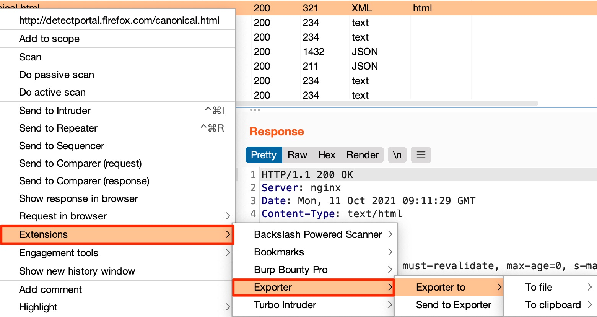

# Exporter Extension for Burp Suite (Community and Pro)

Follow us to know more about tips and others extensions 

## Description
Exporter is a [Burp Suite](https://portswigger.net/burp/) extension to copy a request to a **file** or the **clipboard** as multiple programming languages functions.

You can export as:
- cURL
- Wget
- Python Request
- Perl LWP
- PHP HTTP_Request2
- Go Native
- NodeJS Request
- jQuery AJAX
- PowerShell
- HTML Forms
- Ruby Net::HTTP
- JavaScript XHR

## Requirements

 - [Jython](https://www.jython.org/download) >= 2.7.1

## Installation (Import function)
- Download [Exporter.py](https://github.com/artssec/burp-exporter/blob/master/Exporter.py)
- In Burp Suite, under the `Extender/Extensions` tab, click on the `Add` button, select Extension type `Python`  and load the `Exporter` py file.

## Usage
You can copy the request from:
 - Target > Tree and Site map
 - Proxy > Intercept
 - Proxy > HTTP history
 - Repeater
 - Intruder > Positions and Results
 - Search results
 - Scanner results

 ### Screenshot
 Right click > Extensions > Exporter > `to File`/ `to Clipboard` or `Send to Exporter`.
 
 
 Also you can send HTTP Requests to the `Exporter tab` and then select the code snippets preferred.
 

## Changelog v1.0
 - Added support for HTML Forms, Ruby Net::HTTP, JavaScript XHR.
 - Added a tab called Exporter, where you can search and filter URLs, also export from there to a file or copy to the clipboard.

## Reporting bugs and collaboration
 - Please, use the GitHub [Bug Report](https://github.com/artssec/burp-exporter/issues/new?assignees=artssec&labels=bug&template=Bug_Report.md&title=).
 - If you want to collaborate, use the GitHub [Feature Request](https://github.com/artssec/burp-exporter/issues/new?assignees=artssec&labels=enhancement&template=Feature_Request.md&title=).
